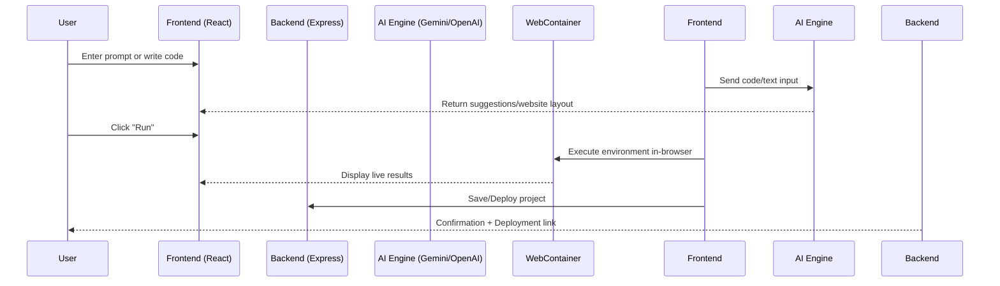

# 🐍 Cobra AI 2.0 — Next-Gen AI-Powered Development Platform

[](https://choosealicense.com/licenses/mit/)


**Cobra AI 2.0** is the ultimate AI-powered coding and website-building platform for developers and creators. Build, run, debug, and deploy full-stack projects in real-time with intelligent AI assistance — all within your browser.

---

## 🚀 Live Demo

🔗 [View Live App](#) | 💻 [GitHub Repository](https://github.com/201Harsh/Cobra-AI-2.0)

---

## 📘 Table of Contents

- [About Cobra AI 2.0](#-about-cobra-ai-20)
- [Features](#-features)
- [System Overview](#-system-overview)
- [Creator Mode Keywords](#-creator-mode-keywords)
- [Tech Stack](#-tech-stack)
- [Installation & Usage](#-installation--usage)
- [SEO & Marketing](#-seo--marketing)
- [Contributing](#-contributing)
- [License](#-license)
- [Contact](#-contact)

---

## 🧠 About Cobra AI 2.0

**Cobra AI 2.0** is a full-stack AI-driven coding and creation platform designed to empower both **developers** and **non-technical creators** to:

- 💻 Write, run, and debug full-stack code in real-time.
- 🤖 Receive intelligent code suggestions powered by AI.
- 👥 Collaborate live in real-time coding sessions.
- 🧱 Instantly generate professional websites from text prompts using AI.

It’s built to **boost productivity**, **streamline development workflows**, and help creators **build professional apps and websites effortlessly**.

---

## ✨ Features

| Category                              | Description                                                                   |
| ------------------------------------- | ----------------------------------------------------------------------------- |
| 💡 **AI Code Assistant**              | Smart real-time code suggestions for React, Node.js, Express, and MERN stack. |
| 👨‍💻 **Real-Time Collaboration**        | Work together live on shared code sessions.                                   |
| ⚡ **AI Debugger**                    | Detect and fix code issues automatically using AI.                            |
| 🧠 **Creator Mode (Text-to-Website)** | Instantly generate responsive websites from natural language prompts.         |
| 🎨 **Drag-and-Drop Builder**          | Modify generated designs visually with AI-powered assistance.                 |
| 🌐 **Cross-Platform Ready**           | Build web apps, landing pages, and SaaS platforms.                            |
| 📦 **Instant Setup**                  | Auto-configured Vite + Node.js environment.                                   |
| 🧩 **Integrated Live Preview**        | See your frontend and backend updates instantly.                              |

---

## 🔁 System Overview



---

## 🪄 Creator Mode Keywords

AI website builder, text to website, AI website generator, one-click website creation, drag and drop website builder, AI landing page builder, no-code website builder, automated website design, AI web app creator, instant website builder, AI site generator, create website from text, AI design assistant, AI homepage generator, intelligent website builder, responsive website builder, AI SaaS creator, fast web builder, no-code web app builder.

---

## 🧩 Tech Stack

| Layer              | Technologies Used                                    |
| ------------------ | ---------------------------------------------------- |
| **Frontend**       | React.js, Vite, Tailwind CSS, Framer Motion          |
| **Backend**        | Node.js, Express.js                                  |
| **Database**       | MongoDB / MySQL (configurable)                       |
| **AI Integration** | Google Gemini API / OpenAI API                       |
| **Runtime**        | WebContainers for live preview & real-time execution |
| **Deployment**     | Render / Vercel / Docker support                     |

---

## 🛠 Installation & Usage

### 📦 Prerequisites

- Node.js v18+
- MongoDB (Local or Atlas)
- (Optional) Gemini / OpenAI API Key

### ⚙️ Setup Instructions

#### 1️⃣ Clone the Repository

```bash
git clone https://github.com/201Harsh/Cobra-AI-2.0.git
cd Cobra-AI-2.0
```

#### 2️⃣ Install Dependencies

```bash
npm install
```

#### 3️⃣ Run the Development Server

```bash
npm run dev
```

- **Backend:** `http://localhost:4000`
- **Frontend:** `http://localhost:3000`

---

## 💻 Usage

1. Open the **frontend** in your browser.
2. Enter a **prompt** to generate a website using AI.
3. Modify design with the **drag-and-drop** editor.
4. Run full-stack code with **real-time preview**.
5. Collaborate with others using the **live coding feature**.

---

## 📈 SEO & Marketing

Cobra AI 2.0 is optimized for growth with built-in SEO features:

- 🔍 SEO-ready meta tags for AI-generated sites.
- 🖼 Open Graph images for social sharing.
- ⚡ Lightning-fast load speeds (Vite optimization).
- 📱 Fully responsive web layouts.

---

## 🤝 Contributing

We welcome contributions from the community!

1. Fork the repository
2. Create a feature branch
   ```bash
   git checkout -b feature/your-feature
   ```
3. Commit your changes
   ```bash
   git commit -m "Add new feature"
   ```
4. Push to GitHub
   ```bash
   git push origin feature/your-feature
   ```
5. Open a Pull Request

---

## 🪪 License

```text
MIT License
Copyright (c) 2025 Harsh
Permission is hereby granted, free of charge, to any person obtaining a copy...
```

---

## 📮 Contact

- GitHub: [https://github.com/201Harsh](https://github.com/201Harsh)
- Instagram: [https://www.instagram.com/201harshs/](https://www.instagram.com/201harshs/)
- Email: support@endgamingai2@gmail.com

---

## 🌟 Final Thoughts

**Cobra AI 2.0 isn’t just a tool — it’s your intelligent coding companion.**  
Empowering creators and developers to build the future of the web, one AI-assisted project at a time.

### 🧠 Built with passion by [Harsh](https://github.com/201Harsh)
